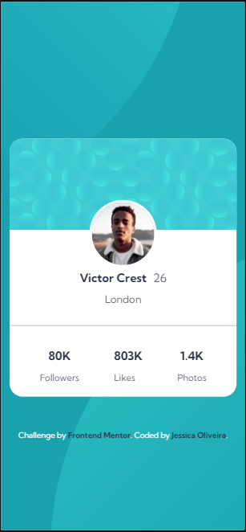
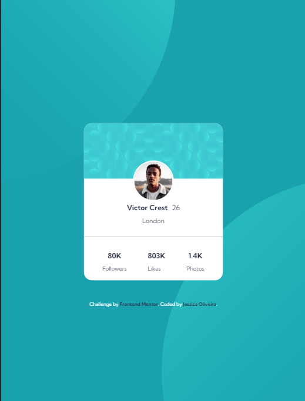
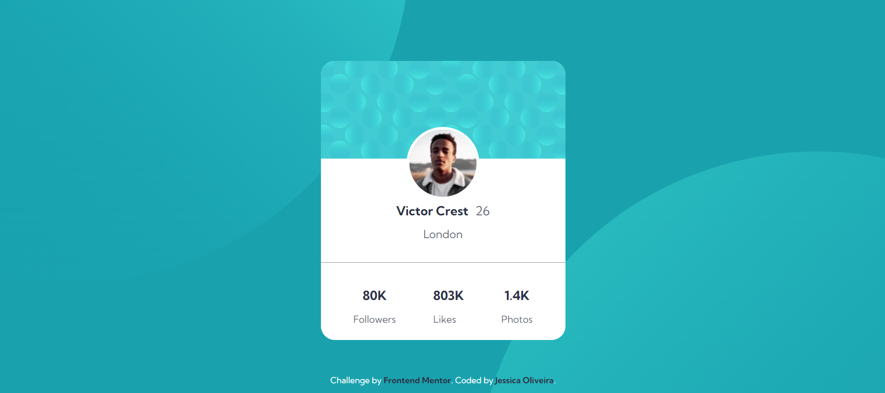

# Profile-card-component
Este desafio foi retirado do site Frontend Mentor.  
[Clique aqui](https://www.frontendmentor.io/challenges/profile-card-component-cfArpWshJ) para visistar a página.

## Do que se trata esse desafio?
Trata-se de um cartão com algumas informações sobre um perfil.

## Habilidades desenvolvidas:
- Uso de tags semânticas.
- Uso de flexbox para ajuste dos elementos na tela.
- Uso de mediaqueries para responsividade.

## Linguagens Utilizadas:
- HTML 

- CSS  

## Veja como ficou:
### Mobile

### Tablet

### Desktop:

Para ver o projeto pronto, [clique aqui!]( https://jessica-os.github.io/Profile-card-component/)
